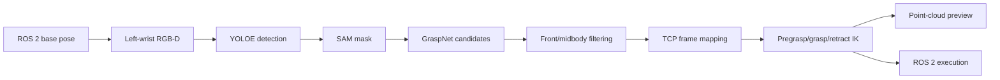

# Isaac Sim GraspNet ROS 2 Pipeline

An end-to-end RGB-D grasping pipeline for a dual-arm mobile manipulator in
NVIDIA Isaac Sim. The reference task detects a first-row AD Calcium Milk
bottle, segments it, generates GraspNet candidates, solves TCP-aware IK, and
executes the validated trajectory through ROS 2.

## Pipeline



Key behaviors:

- Selects a complete white target from the first shelf row.
- Restricts GraspNet points to the YOLO/SAM target mask and bottle midbody.
- Rejects approaches from behind the object or inside the shelf.
- Maps the GraspNet frame to the real gripper TCP frame.
- Resolves the parallel-gripper 180-degree orientation ambiguity.
- Validates pregrasp, grasp, and retract IK before publishing commands.
- Stops execution when joint feedback or safety checks fail.

## Repository Layout

```text
.
|-- config/
|   |-- pipeline.env.example
|   `-- tcp_extrinsic.json
|-- assets/usd/              # complete portable Isaac Sim scene bundle
|-- model/                   # GraspNet, YOLOE, and SAM weights via Git LFS
|-- third_party/             # local source snapshots with original licenses
|-- docs/
|   |-- architecture.md
|   `-- isaac_sim_setup.md
|-- scripts/
|   |-- perception/
|   |-- planning/
|   `-- ros/
|-- outputs/                 # generated files, ignored by Git
|-- requirements.txt
`-- run_pipeline.sh
```

## Tested Environment

- Ubuntu with NVIDIA GPU and Docker
- NVIDIA Isaac Sim 5.1.0
- ROS 2 Jazzy
- Python 3.10 perception/GraspNet environment
- Ultralytics 8.4.93
- GraspNetAPI 1.2.11

Isaac Sim Python packages are supplied by the Isaac Sim container. ROS Python
packages are supplied by the ROS 2 container and are not installed from
`requirements.txt`.

## Installation

Install Git LFS, clone the private repository, and fetch all LFS objects:

```bash
git lfs install
git clone https://github.com/YOUR_NAME/isaacsim-graspnet-ros2-pipeline.git
cd isaacsim-graspnet-ros2-pipeline
git lfs pull
python3 -m venv .venv
source .venv/bin/activate
pip install -r requirements.txt
```

The private repository includes the locally tested GraspNet Baseline,
GraspNetAPI, Ultralytics Python source snapshot, model weights, and portable
USD bundle. Their original licenses still apply.

Build the GraspNet CUDA extensions for the active Python/PyTorch environment:

```bash
cd third_party/graspnet-baseline/pointnet2
python setup.py install
cd ../knn
python setup.py install
cd ../../..
```

Create the local configuration:

```bash
cp config/pipeline.env.example config/pipeline.env
```

Edit `config/pipeline.env` for your containers, Python environment, camera prim,
and robot base pose. Bundled model and USD paths are used by default.
Recalibrate `config/tcp_extrinsic.json` if the gripper geometry changes.

Mount this repository into the Isaac Sim container at the path configured by
`REPO_ISAAC`. See [Isaac Sim setup](docs/isaac_sim_setup.md).

## Usage

Start Isaac Sim, open the USD, load `scripts/ros/isaac_topic_control.py` in the
OmniGraph Script Node, press Play, and verify ROS communication.

Generate detection, segmentation, grasp, IK, and visualization results without
moving the arm:

```bash
./run_pipeline.sh preview
```

Inspect:

```text
outputs/latest/grasp_preview.png
outputs/latest/metrics.json
outputs/latest/ik.json
```

Run the complete pipeline and execute only after IK validation passes:

```bash
./run_pipeline.sh execute
```

The preview mode still moves the mobile base to the configured recognition
pose. It does not publish arm commands.

## ROS 2 Topics

| Topic | Type | Direction |
|---|---|---|
| `/enable_flag` | `std_msgs/Bool` | ROS 2 to Isaac Sim |
| `/base_target_pose` | `geometry_msgs/PoseStamped` | ROS 2 to Isaac Sim |
| `/joint_states_gripper_l` | `sensor_msgs/JointState` | ROS 2 to Isaac Sim |
| `/debug/robot_pose` | `geometry_msgs/PoseStamped` | Isaac Sim to ROS 2 |
| `/left_arm/current_joint_states` | `sensor_msgs/JointState` | Isaac Sim to ROS 2 |

## Safety

This project is a research prototype. The executor uses smooth joint-space
interpolation and feedback checks, but it is not a complete collision-aware
motion planner. Validate in simulation, inspect the preview, and add collision
checking before using the pipeline on physical hardware.

## Third-Party Components

This private repository contains local source snapshots, model weights, and
simulation assets for internal reproducibility. Their original licenses still
apply; see [third-party notices](THIRD_PARTY_NOTICES.md) and
[private repository notice](PRIVATE_REPOSITORY_NOTICE.md).

See [dependency boundaries](docs/dependencies.md) for the exact difference
between the small pipeline wrappers, installed model packages, GraspNetAPI,
and the GraspNet neural-network implementation.

## License

The pipeline code in this repository is released under the MIT License. See
[LICENSE](LICENSE).
